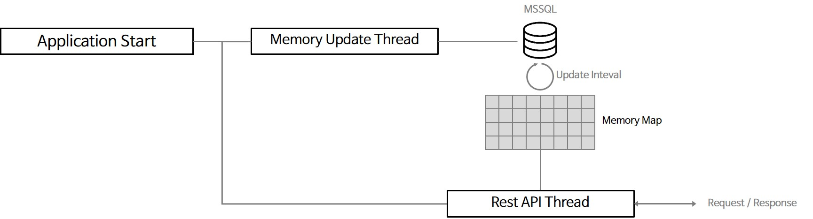

# 📌 Information
### ✨ Version
- OS: Windows 10/11
- IDE: Visual Studio 2022 Community
- Language: C#(.Net 4.8)

<br><br><br>
### ✨ API Specs

#### 1️⃣ 디바이스 리스트 조회
##### Method
> HTTP/1.1 GET
##### Path
> /api/deviceList
##### Request
> 　
##### Request Header
> 　
##### Response
> ```
> {
> 　"deviceList": [
> 　　{
> 　　　"name": "AHU1",
> 　　　"description": "1",
> 　　　"protocol": "BACnet",
> 　　　"content1": "192.168.30.1",
> 　　　"content2": "47808",
> 　　　"content3": "7701"
> 　　}
> 　]
> }
> ```
##### Response Header
> 　
##### Result Preview
> 　 

<br>

#### 2️⃣ 특정 디바이스의 하위 태그 조회
##### Method
> HTTP/1.1 GET
##### Path
> /api/device/{deviceName}
##### Request
> 　
##### Request Header
> 　
##### Response
> ```
> {
> 　"AHU1": [
> 　　{
> 　　　"name": "TAG1",
> 　　　"description": "1층 공조기",
> 　　　"type": "Analog",
> 　　　"value": 5.5,
> 　　　"isAlarm": 1
> 　　}
> 　]
> }
> ```
##### Response Header
> 　
##### Result Preview
> 　 

<br>

#### 3️⃣ 특정 태그 조회
##### Method
> HTTP/1.1 GET
##### Path
> /api/tag/{tagName}
##### Request
> 　
##### Request Header
> 　
##### Response
> ```
> {
> 　"TAG1": {
> 　　"name": "TAG1",
> 　　"description": "1층 공조기",
> 　　"type": "Analog",
> 　　"value": 5.5,
> 　　"isAlarm": 1
> 　}
> }
> ```
##### Response Header
> 　
##### Result Preview
> 　 

<br>

#### 4️⃣ 알람 발생 태그 조회
##### Method
> HTTP/1.1 GET
##### Path
> /api/tag/{tagName}
##### Request
> 　
##### Request Header
> 　
##### Response
> ```
> {
> 　"tagList": {
> 　　"deviceName": "AHU1",
> 　　"deviceDescription": "공조기1",
> 　　"tagName": "TAG1",
> 　　"tagDescription": "1층 공조기의 온도설정",
> 　　"type": "Analog",
> 　　"value": 5.5,
> 　　"isAlarm": 1
> 　}
> }
> ```
##### Response Header
> 　
##### Result Preview
> 　 

<br><br><br><br><br>
# 📌 Architecture


